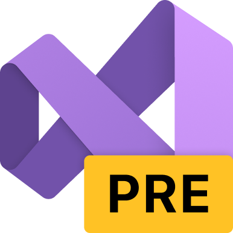

<h1>👋 | Olá! </h1>

Olá! Eu sou o Win(Vitor) sou o criador da <a href="https://foxywebsite.ml">Foxy</a> e eu gosto de raposas, Snoop Dogg, Reggae, etc

   <h3 align="left">🔨 <b>|</b> Linguagens</h3>

      
      
    

  
🦦 | Pretendo estudar

  <ul>
     <li>C</li>
      <li>C++</li>
     <li>C#</li>
     <li>Assembly</li>
  </ul>

<h3 align="left">🔨 <b>|</b> Ferramentas</h3>

    
    
       
    
    
  
   
   
       
                 

<h3 align="left"> 📱 <b>|</b> Contato </h3>
<ul align="left">
    <li>Discord: <a href="https://discord.com/users/687867247116812378">Win#1979</a></li>
    <li>Twitter: <a href="https://twitter.com/WinG4merBR">@WinG4merBR</a></li>
</ul>

 
